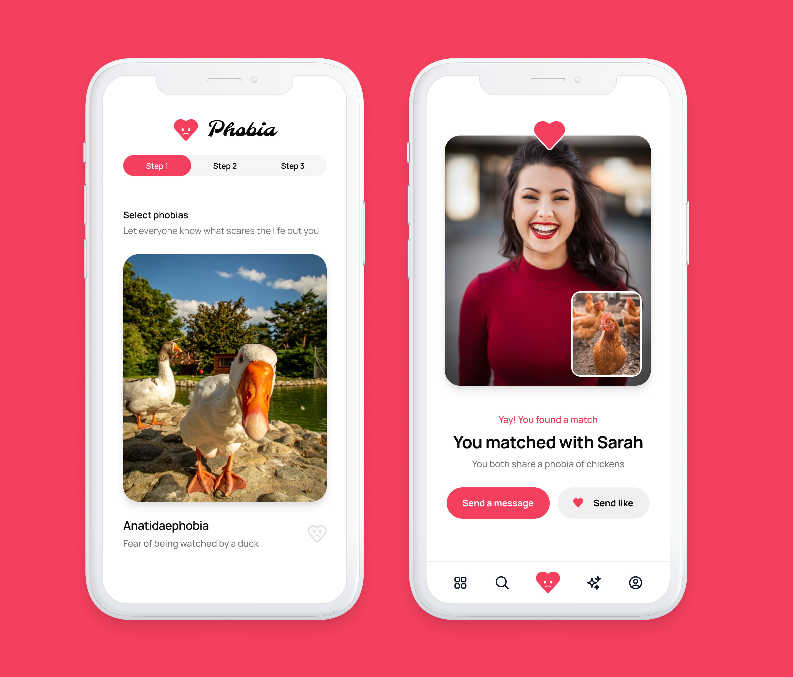

import logo from './nissan-ariya.jpg'
import imageHero from './hero.jpg'
import imageJennyWilson from './jenny-wilson.jpg'

export const caseStudy = {
  client: 'Nissan',
  title: 'Transformation on the horizon: reimagining the Nissan Ariya journey',
  description:
    "Led the redesign of Nissan's Ariya configurator and the product-card entry points on the rebranded browse pages driving traffic into it, from first click through to a final action — Book a Test Drive, Contact, or Virtual Showroom.",
  summary: [
    "In 2020, Nissan paired the launch of its first all-electric SUV, the Ariya, with its first new logo in 20 years — a single moment meant to signal a shift toward advanced technology and seamless digital experience.",
    "I owned the customer journey that had to carry that promise: from the reimagined browse page, through an updated configurator, to a clear final action — across markets with very different technical constraints and brand expectations.",
  ],
  logo,
  image: { src: imageHero },
  date: '2020-12',
  service: 'Experience Lead',
  testimonial: {
    author: { name: 'Dip Shah', role: 'Senior Manager, Global CX Optimization Lead, Nissan' },
    content:
      "This particular project was all about improving the digital experience. We saw the increased frustration through Medallia DXA and wanted to really bring that down for our customers. It was great to see the impact of a better experience on our KPIs.",
  },
}

export const metadata = {
  title: caseStudy.title,
  description: caseStudy.description,
}

## Situation

In July 2020, Nissan unveiled its first new logo in 20 years alongside the launch of the Ariya — the brand's first all-electric crossover SUV. It was billed as more than a product launch: a digital World Premiere blending the car reveal with the new identity, signalling Nissan's shift toward advanced technology and a genuinely seamless customer experience.

The configurator sat right at the centre of that promise, and it wasn't ready. Some early work had already started in Australia — an A/B test for choosing your car and model, built by a UX designer who left the project in a hurry with barely any handover. It was performing reasonably well, but it was inconsistent, and user feedback made it clear people were struggling to find the information they actually wanted.

Underneath that sat a harder problem: legacy back-end systems that made it genuinely difficult to keep anything consistent across markets, and a launch sequence — Japan and Europe first, the US market to follow — that meant the design had to hold together even while rolling out unevenly. And a redesigned configurator was only half the job: it also needed the right traffic reaching it in the first place, which meant rethinking how the newly rebranded product and brochure pages were driving people in.

## Task

My brief started with the configurator itself: redesigning it end-to-end and resolving it into a clear final action — Book a Test Drive, Contact, or Virtual Showroom. From there, I worked back through the funnel, designing the Ariya product cards on Nissan's newly rebranded browse and brochure pages to drive more qualified clicks into that configurator. I wasn't responsible for the wider browse page redesign itself, or the brand relaunch and launch event — those sat with a separate global agency team. My remit was this specific journey, end to end, across US, Europe and Japan.

That meant reconciling wildly different constraints market to market: language, car culture, and business model vary enormously across the automotive industry, and Nissan was no exception. Every solution had to work for all of them, without diluting into a lowest-common-denominator experience.

It also meant managing people, not just pixels. I was leading a team of UX and UI designers spread across the EU, South America and Japan — different time zones bookended by Colombia on one side and Japan on the other. Partway through, our PM left the workload of organising timelines and user stories to me while we waited for a replacement; we then went through three different POs in three months. Keeping the team aligned meant getting seriously disciplined about feedback loops and preparation — there wasn't room for anything less.
<TwoColumn>
  

  

</TwoColumn>

Every design decision went through real user testing rather than assumption. Across two rounds of unmoderated remote testing (via Userbrain, 8 participants per round), we validated — and in some cases overturned — our own instincts. The clearest example: our first version of the "more information" overlay unexpectedly navigated users to a completely different page when they clicked through. Every single participant found this disorienting; several assumed the prototype was broken. We changed course, keeping the overlay in place on the same page instead — and in the next round of testing, it was the version every user preferred.

The same rigour applied further down the funnel. When we tested two different approaches for showing additional colour options tied to a version change, 6 of the 8 participants preferred the version that explained *why* the change was happening, rather than just presenting it. That's the one we shipped.

Working alongside Dip Shah and Nissan's Global CX team, we also used behavioural analytics tooling to find exactly where customers were dropping off in production, not just in prototypes. That surfaced concrete, unglamorous problems: a pre-sales contact form with a confusing dropdown menu, a test-drive booking flow that made customers repeat the same choices twice, and a Configurator journey that lost people between the Vehicle Compare tool and the actual configuration step.

## Result

<StatList>
  <StatListItem value="32.5%" label="increase in pre-sales form completion after switching a dropdown to radio buttons" />
  <StatListItem value="9.9%" label="increase in test-drive form completion on desktop (6.3% on mobile)" />
  <StatListItem value="86%" label="improvement in Configurator Completion Rate after removing a duplicated decision step" />
  <StatListItem value="39%" label="increase in pre-sale leads from a clearer Ariya Visualizer call to action" />
</StatList>

One participant's reaction to the redesigned configurator summed up what we'd been aiming for: *"very slick, very professional."* Not flashy — just a journey that finally got out of its own way.

None of this happened on a stable team. Across the project I was leading UX and UI designers spread over three continents — EU, South America and Japan — through a stretch with no PM and three different POs in three months. Keeping the work on track meant becoming disciplined about feedback loops out of necessity: tight, well-prepared check-ins across time zones that didn't overlap, and a habit of documenting decisions clearly enough that continuity didn't depend on any one person being in the room. That structure is arguably as much a part of this project's result as the metrics above — the team delivered a global, multi-market redesign without ever having a stable leadership triangle behind it.

The [Spain configurator](https://www.nissan.es/vehiculos/nuevos-vehiculos/ariya/version-explorer/configurar.html) built on this journey structure is still live today, several years on from launch — and [Japan's configurator](https://www3.nissan.co.jp/vehicles/new/ariya/version-explorer/configurator-v3.html) still runs on the same step-by-step structure we designed, grade through to estimate.

<Blockquote author={caseStudy.testimonial.author}>
  {caseStudy.testimonial.content}
</Blockquote>