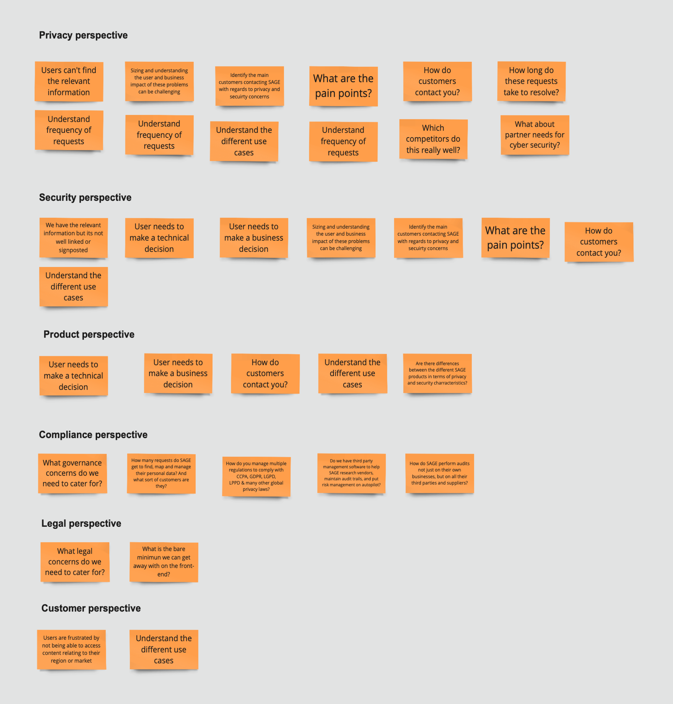
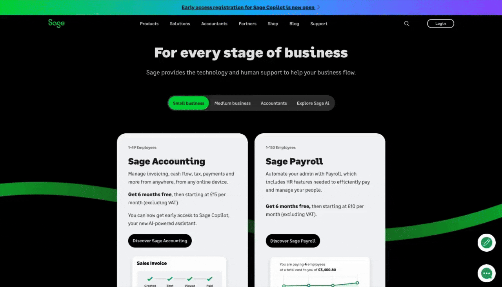
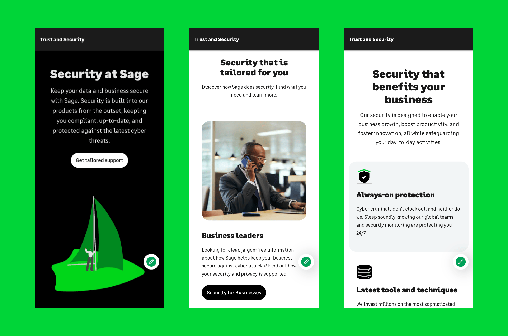
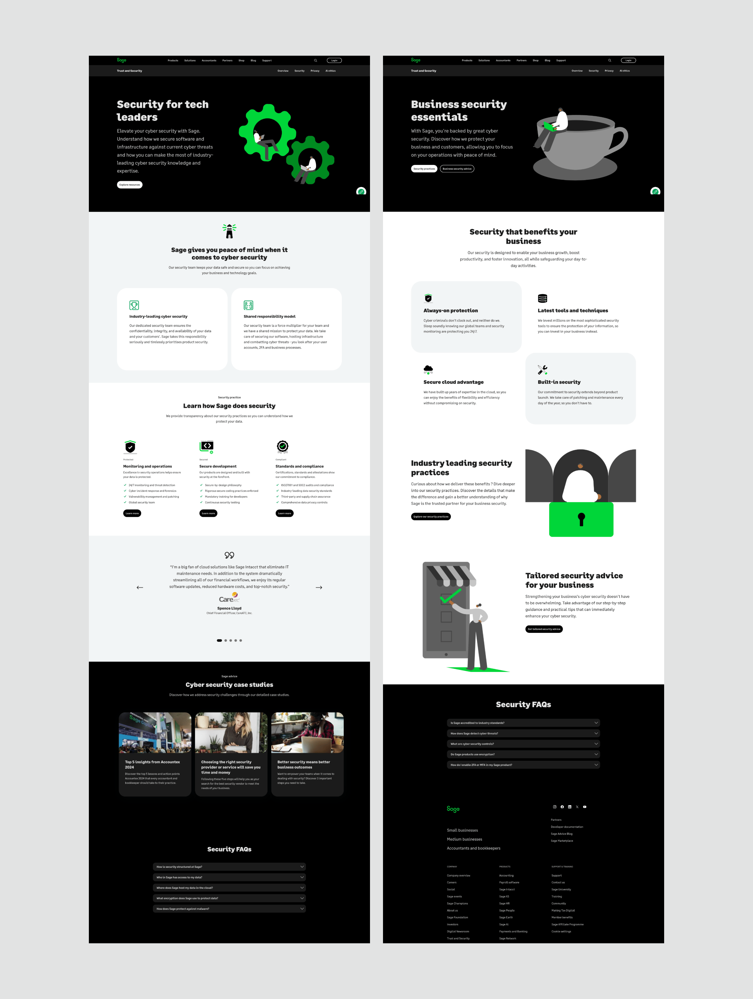
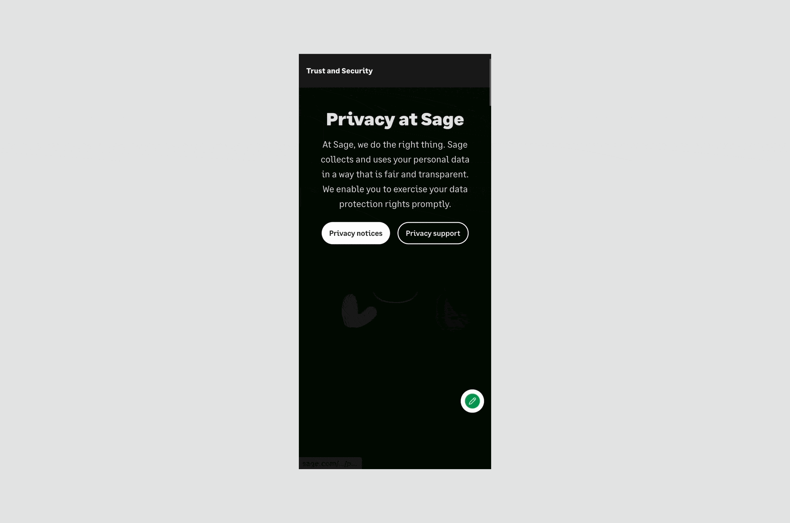
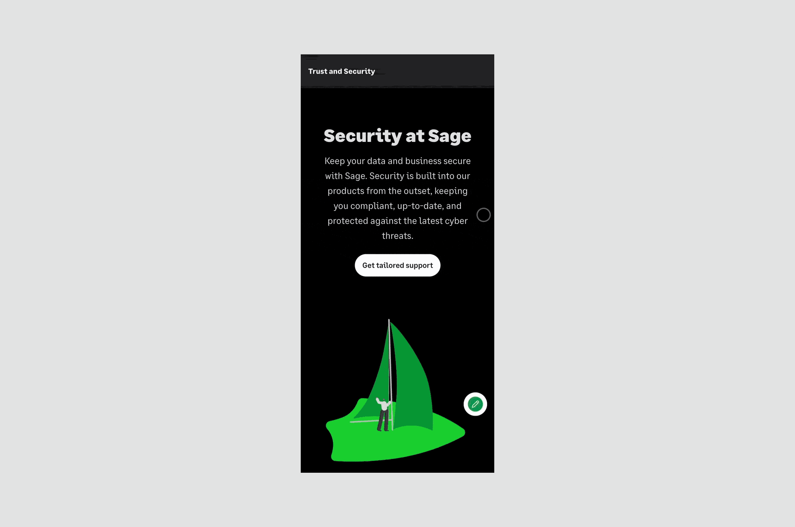

import logo from '@/images/clients/sage/sagetrust.jpg'
import imageHero from './hero.png'

export const caseStudy = {
  client: 'Sage',
  title: "Trust hub showcasing Sage's commitment to data security and privacy",
  description:
    'Sage, a global leader in cloud-based business management software sought to launch a Security and Privacy Trust Hub to enhance customer trust and communicate its commitment to data protection.',
  summary: [
    'Sage, a global leader in cloud-based business management software sought to launch a Security and Privacy Trust Hub to enhance customer trust and communicate its commitment to data protection.',
  ],
  logo,
  image: { src: imageHero },
  date: '2022-02',
  service: 'Senior UX Designer',
  link: 'https://www.virginatlantic.com/case-studies/digital-unification',
  testimonial: {
    author: { name: 'Emily Selman', role: 'Head of Engineering at Unseal' },
    content:
      'Studio did an amazing job building out our core blockchain infrastructure and I’m sure once PlaceboCoin rallies they’ll be able to finish the project.',
  },
}

export const metadata = {
  title: `${caseStudy.client} Case Study`,
  description: caseStudy.description,
}

## Business challenge

With growing concerns around data security and privacy, Sage needed a dedicated space to clarify its security measures, privacy policies and certifications. The challenge was to design a hub within their existing infrastructure that balanced transparency with accessibility, while aligning with Sage’s brand guidelines and addressing user needs in a digestible format.

This hub would serve as a central resource for customers, helping them understand how Sage handles data protection and fostering confidence in the company’s products. The project aimed to position Sage as a leader in secure, compliant business solutions while addressing user concerns in an approachable and understandable way.

After thorough research including competitor benchmarking and stakeholder interviews, I identified several key pain points among our target users - small business owners, IT managers and compliance officers.

The most prominent user pain points included difficulty finding clear and accessible security information, lack of transparency around certifications and compliance e.g ISO 27001, concerns about data handling and privacy and confusion around security features and settings.

In close collaboration with the Chief Risk Officer, a business analyst and a content designer, we set out to create a seamless user experience, simplify jargon and give existing and new Sage customers the confidence that their data was safe.

<Blockquote>
The goal was to design a site that made it easy to access relevant information, reduce complexity, and help users feel more secure in Sage’s practices.
</Blockquote>

## Strategy & Approach

As the Senior UX Designer leading the project, my approach centred around the following principles:

### 1. Simplicity & clarity
Ensuring users could find key information without feeling overwhelmed.

### 2. Transparency & trust
The design needed to reflect Sage’s commitment to security, showcasing transparency in every step of the journey.

### 3. User-centric design
Creating an intuitive structure and navigation that guides users to the information they cared about most.

### 4. Brand consistency
The hub needed to align with Sage’s existing branding and aesthetic to ensure a cohesive experience across platforms.

## Design evolution

I initially explored three potential design directions: 

**Informational hub** - which grouped content into well-defined categories such as security features, privacy policies, and certifications.

**Interactive flow journey** - offering a dynamic experience that guided users through key security topics based on their needs and concerns.

**Visual dashboard** -  featuring a layout that showcased Sage’s security features, certifications, and statistics in an easily scannable format using visuals like icons and charts.

Given the limitations of the existing site architecture, we chose to move forward with the informational hub approach. The current site’s backend structure wasn’t flexible enough to support an interactive flow or a complex dashboard with real-time content updates.

The informational hub approach would allow users to navigate the security and privacy information easily, while still presenting all the important security and privacy details.

## Design prototyping

I then developed wireframes and prototypes based on this direction, prioritising an intuitive layout for easy navigation. I focused on ensuring the typography was clear and legible, particularly for dense legal and technical content. Simple, intuitive icons were used to represent security concepts, making complex information more accessible. To enhance usability, I incorporated expandable text sections and FAQs, allowing users to explore specific topics in more detail without feeling overwhelmed by information overload.

## Validation and user testing

To validate the design, I conducted user testing with a group of small business owners and IT professionals to ensure that users could easily find the information they were looking for and understand complex concepts like data certifications.

During testing, we focused on three key areas:

**1. Navigation** – checked if users could easily find sections like privacy policies or security certifications.

**2. Usability** – evaluated whether the design felt intuitive or if users struggled to find key information.

**3. Comprehension** – assessed if users left with a clearer understanding and stronger trust in Sage’s data protection practices.

The feedback was overwhelmingly positive — users found the structure clear, with most noting the ease of navigating between sections. However, they also expressed interest in having more prominent visual elements like icons or charts to help them quickly digest key points.

I was surprised by how much users valued the simplicity and clarity of the content layout; despite expecting them to prefer more interactive features, they expressed a clear preference for straightforward, easy-to-scan information. 

However, one challenge was the dense, technical language used in some of the privacy and compliance sections, which made it difficult for users to grasp the importance of certifications like ISO 27001, often leading them to gloss over these details. To address this, I collaborated with the content team to simplify the language and add contextual explanations for technical terms.

## Adaptations

Initially, the site felt a bit too "flat" and text-heavy, leading to user fatigue, and despite simplifying the content, some users still struggled to engage fully with the information. To address this, I introduced quick summaries at the top of each section with clear headings such as "Learn how Sage does security" which allowed users to grasp the key point before diving into the more detailed content.

I art directed an animator to bring existing flat illustrations to life, adding dynamic visual elements to enhance user engagement.

Additionally, I commissioned videos and case studies from Sage stakeholders to showcase the company’s expertise, further building trust and confidence with users by highlighting real-world applications and success stories.

## Challenges
Working with the legal and compliance stakeholders was challenging due to their strict requirements regarding language and the presentation of certifications. Legal teams were concerned about using simplified terminology for certifications, fearing it could dilute the accuracy.
I overcame this by creating a collaborative review process, where I worked closely with legal to ensure both the accuracy of the information and its user-friendliness. We established a set of key principles for simplified terminology that maintained regulatory integrity but was easier for users to understand.

## Results

The Security and Privacy Trust Hub launched in August 2022 and is still going strong today, which speaks volumes about its quality and lasting impact.

**Increased engagement** - analytics showed that users spent significantly more time on the Trust Hub compared to other informational sections of the website, indicating a high level of engagement.

**Improved trust** - user surveys post-launch revealed a 25% increase in users reporting confidence in Sage’s data protection and security practices.

**Positive stakeholder feedback** - internal teams, particularly legal and compliance, were delighted with the design’s balance between technical accuracy and user accessibility.

<a href="https://www.sage.com/en-gb/trust-security/" className="text-xl inline-flex items-center font-medium text-primary transition hover:text-secondary">View final solution<svg className="w-4 h-4 ms-2 rtl:rotate-180" aria-hidden="true" xmlns="http://www.w3.org/2000/svg" fill="none" viewBox="0 0 14 10"><path stroke="currentColor" stroke-linecap="round" stroke-linejoin="round" strokeWidth="2" d="M1 5h12m0 0L9 1m4 4L9 9"/></svg></a>
