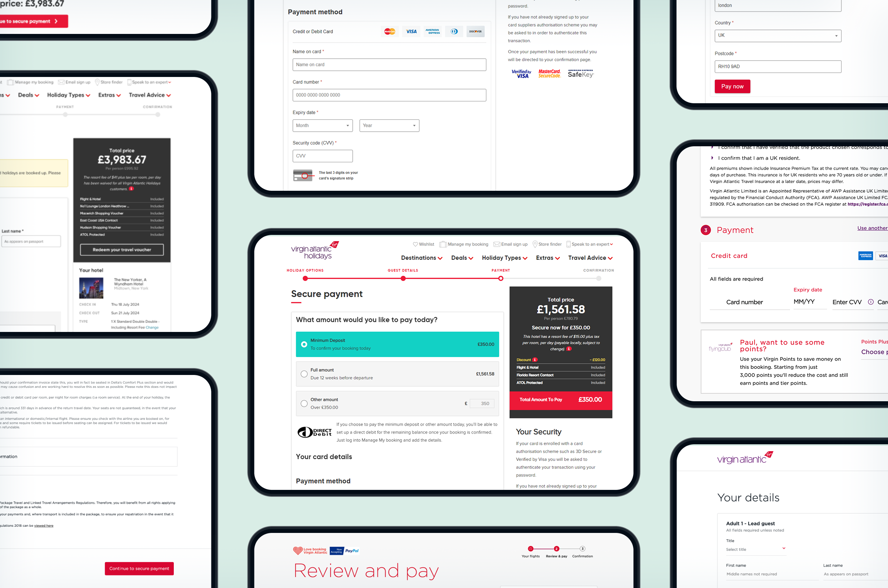
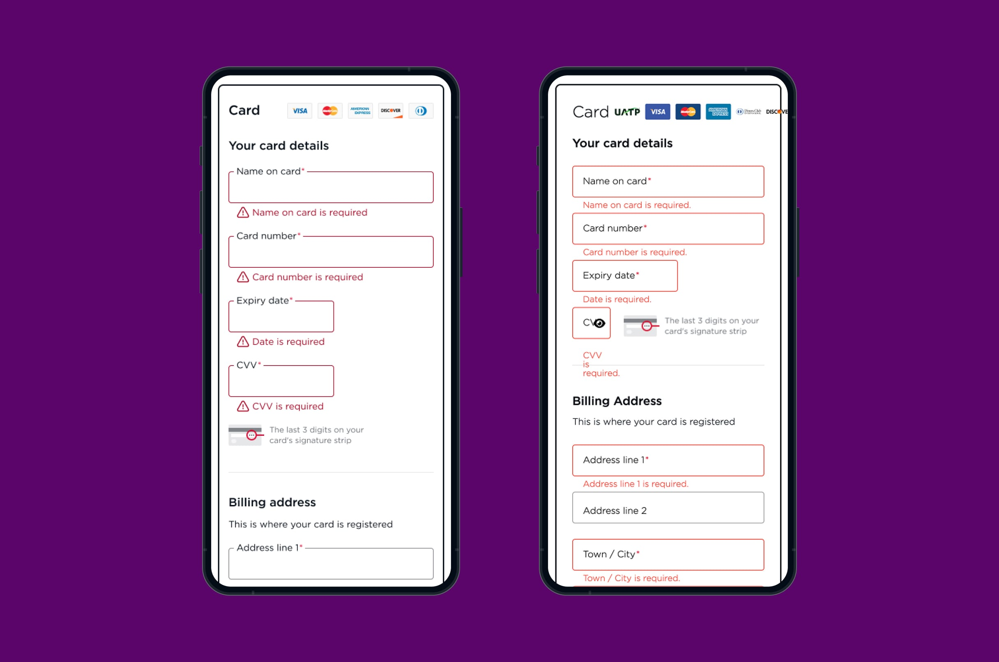

import logo from './checkout.jpg'
import imageHero from './hero.jpg'
import imageBenDuffield from './ben-duffield.jpg'

export const caseStudy = {
  client: 'Virgin Atlantic',
  title: 'Enhancing Virgin Atlantic’s checkout experience',
  description:
    'Virgin Atlantic wanted to improve their online checkout experience by creating a more cohesive and trustworthy journey that aligned their different brands and third-party payment providers. The goal was to reduce drop-off rates and increase conversions by ensuring a seamless, consistent experience that adhered to Virgin Atlantic’s design system.',
  summary: [
    'Virgin Atlantic wanted to improve their online checkout experience by creating a more cohesive and trustworthy journey that aligned their different brands and third-party payment providers. The goal was to reduce drop-off rates and increase conversions by ensuring a seamless, consistent experience that adhered to Virgin Atlantic’s design system.',
  ],
  logo,
  image: { src: imageHero },
  date: '2024-01',
  service: 'Senior Product Designer',
  testimonial: {
    author: { name: 'Jamie Harrington', role: 'Senior Lead - Digital Product at Virgin Atlantic' },
    content:
      'Dylans ability to take a request and bring it to life in design was a major asset for me and really helped us deliver great results.',
  },
}

export const metadata = {
  title: `${caseStudy.client} Case Study - Optimise Checkout`,
  description: caseStudy.description,
}

## Background

The existing checkout flow was inconsistent in its styling and functionality, with long load times between steps - up to 30 secs at times - and varying implementations of third-party payment providers.

## My role and responsibility

As the Senior Product Designer, my responsibility was to enhance the checkout flow while ensuring it aligned with Virgin Atlantic's design system and user experience principles. I needed to:

- Streamline the user journey to reduce friction.

- Ensure that the external payment providers integrated seamlessly into our flow.

- Align all stakeholders, including developers and business teams, to maintain a consistent experience.

## What I did

To achieve this, I took a structured approach:

### 1. User Research & Pain Point Analysis
I conducted usability testing and analysed user drop-off points in the existing checkout flow.

### 2. UX Audit & Guideline Review
I assessed the third-party payment providers’ interfaces to ensure they aligned with Virgin Atlantic's design principles. In doing so I discovered inconsistencies in button styles, typography, input fields, error messaging and user flows.

### 3. Stakeholder Collaboration
I facilitated design review sessions with external teams, walking them through Virgin Atlantic's design system and highlighting areas that needed improvement.

### 4. Prototyping & Validation
I created Figma prototypes showcasing a more seamless checkout experience, ensuring that branding, accessibility, and usability principles were upheld.

### 5. Client Workshop & Alignment
I ran a workshop with internal and external stakeholders to align on best practices, addressing their constraints while ensuring a consistent UX approach.

## Results
As a result, we successfully implemented a more streamlined checkout flow that:

**Reduced drop-off rates by 23%** (based on initial post-launch analytics).

**Improved transaction completion** times by optimising form interactions.

**Maintained brand consistency** across all touchpoints, ensuring third-party payment providers adhered to Virgin Atlantic’s UX standards and design system.

**Strengthened collaboration** between internal teams and external partners, leading to a smoother implementation process.

## Future thinking
Looking ahead, I proposed connecting the third-party payment providers to Virgin Atlantic's design system through Storybook. This would ensure that any updates made to the design system would automatically synchronise across all payment provider interfaces, improving efficiency and consistency moving forward. By streamlining the collaboration between design, development, and external payment teams, this integration would allow for quicker updates and a more seamless checkout experience in the future.

<Blockquote
  author={{ name: 'Jamie Harrington', role: 'Senior Lead - Digital Product at Virgin Atlantic' }}
>
Dylans ability to take a request and bring it to life in design was a major asset for me and really helped us deliver great results.
</Blockquote>