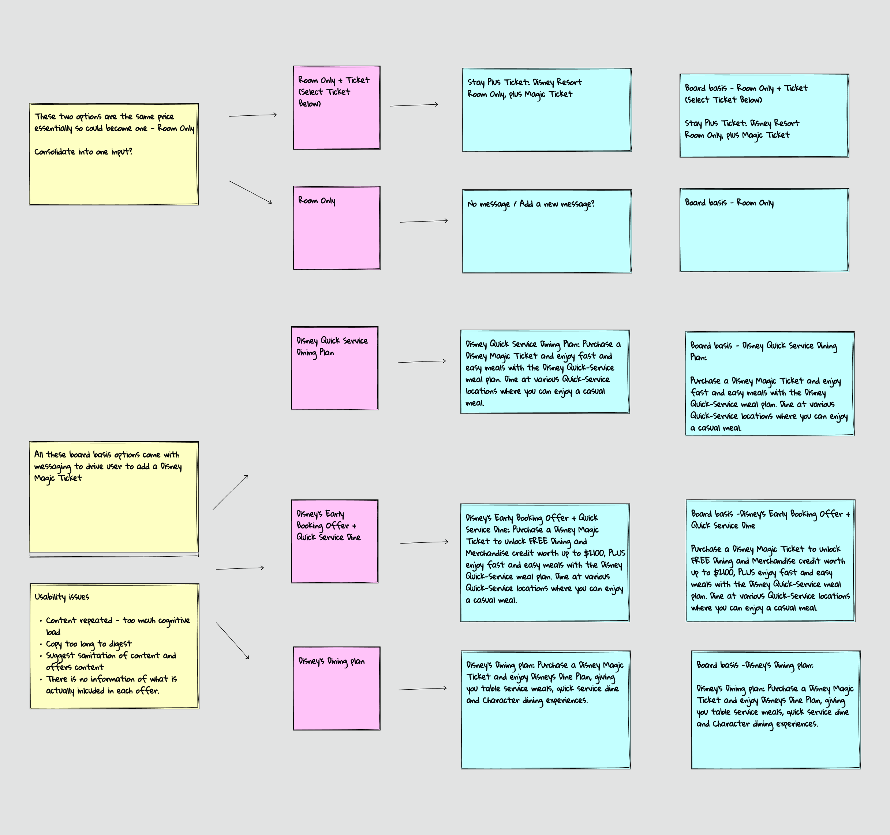
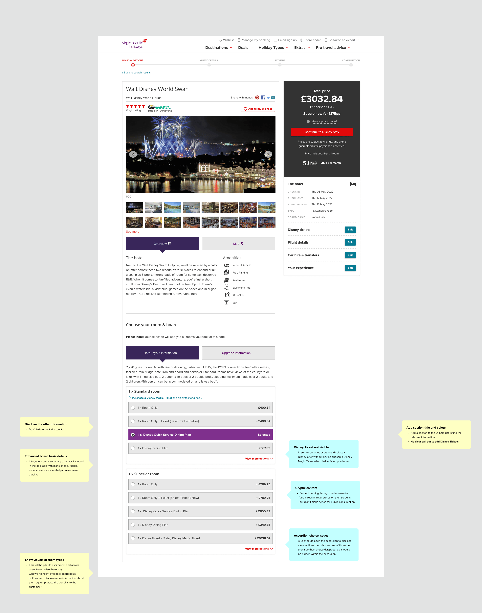
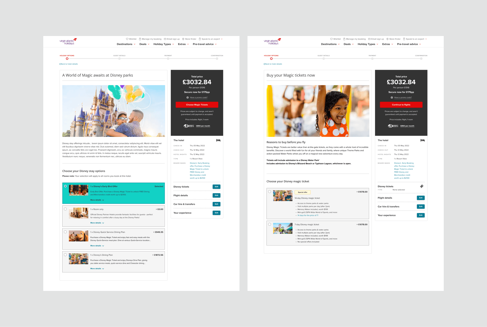
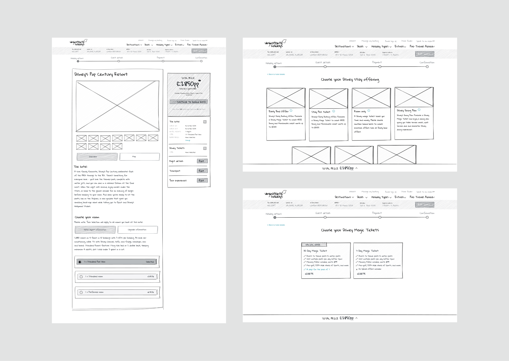
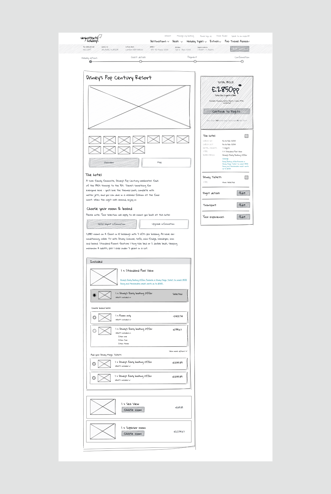
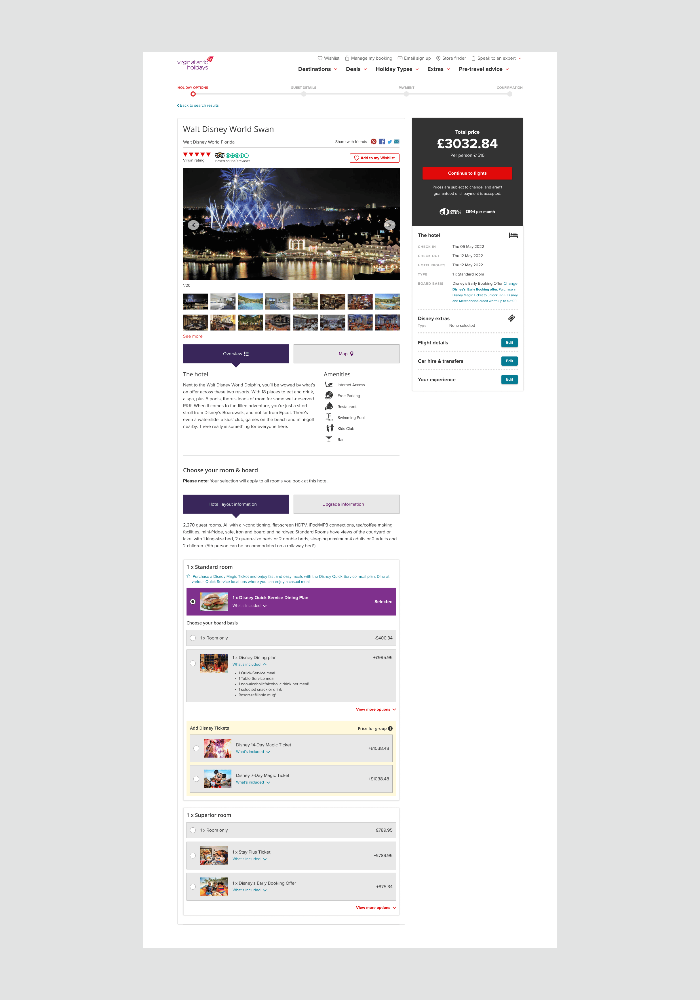
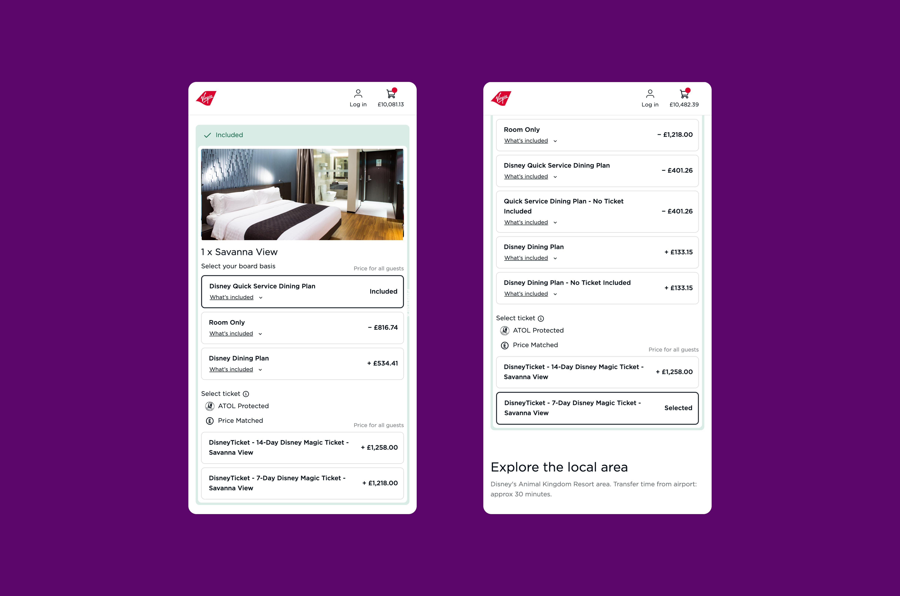

import logo from './disney-ticket.jpg'
import imageHero from './hero.jpg'
import imageBenDuffield from './ben-duffield.jpg'

export const caseStudy = {
  client: 'Virgin Atlantic',
  title: "Virgin Holidays' quest to regain the top spot for Disney bookings",
  description:
    'In 2022, Virgin Holidays, like many companies in the travel and tourism industry, faced significant challenges during and after the COVID-19 pandemic. With travel restrictions, economic uncertainties, and changing customer behaviour, the company needed to evolve to reclaim its market position and reconnect with its customer base—especially when it came to Disney holidays, which were a key part of its portfolio.',
  summary: [
    'In 2022, Virgin Holidays, like many companies in the travel and tourism industry, faced significant challenges during and after the COVID-19 pandemic. With travel restrictions, economic uncertainties, and changing customer behaviour, the company needed to evolve to reclaim its market position and reconnect with its customer base—especially when it came to Disney holidays, which were a key part of its portfolio.',
  ],
  logo,
  image: { src: imageHero },
  date: '2023-08',
  service: 'Senior Product Designer',
  link: 'https://www.virginatlantic.com/case-studies/digital-unification', 
  testimonial: {
    author: { name: 'Benjamin Duffield', role: 'Product design lead' },
    content:
      'Dylan has played an instrumental role in the Virgin Atlantic digital transformation – spanning our browse and book journeys.',
  },
}

export const metadata = {
  title: `${caseStudy.client} Case Study`,
  description: caseStudy.description,
}

## Business challenge

The pandemic forced many travel companies to pivot quickly in order to capture market share as tourism began to rebound. Competitors like TUI, Kenwood, Expedia, Booking.com, and Disney itself ramped up their efforts to attract Disney holiday bookings, offering aggressive pricing strategies, more flexible packages, and exclusive deals.

As a result of this, Disney updated its API to encourage users to add tickets and offerings earlier—during the room selection stage—rather than waiting until checkout. Post lockdown and with a limited team, Virgin Holidays put a quick solution in place but as a result the user experience suffered greatly and conversion was significantly down.

One of the key flaws in the new design led users to mistakenly think they'd added a Disney Magic Ticket after selecting a room and board option, only to find it missing at checkout. This resulted in frustrated customers struggling to understand the issue, overwhelming the call centre. Something needed to be done - and quickly!

## Strategy & Approach

I conducted thorough competitor benchmarking and journey mapping, which helped to identify industry best practices, understand user expectations, and uncover opportunities to differentiate the offering.

With these insights in hand, I quickly identified several obvious opportunities for improvement. For example, the room and board selection area lacked images and supplementary information when it came to Disney offers, which made it harder to engage users with the key benefits of these high-value items.

In close collaboration with my product owner, a content strategist and two developers, we set out to improve the user experience, fix glaring bugs and a restructuring of data within a two month timescale.

<Blockquote>
The objectives became clear: streamline the user experience, highlight the Disney offerings and ultimately make it easier for Virgin Holidays to sell more Magic tickets.
</Blockquote>

## Design evolution

### Before

The current solution lacked inspiration and failed to highlight the key benefits of the Disney packages. Users frequently bounced between confusing board basis options, unable to stay anchored to the correct sections of the page. Board basis information was truncated and hidden behind tooltips. The cognitive load made it difficult for customers to confirm if they were selecting the right rooms, and heat maps showed a sharp increase in abandonment rates.

### Iterations

As the design stage evolved I pursued three potential solutions. The first solution was a progressive stepper approach.

This solution not only enabled us to showcase more inspiring Disney content but also gave us screen real estate to promote key benefits for users. By leveraging progressive disclosure, users were guided through a seamless decision-making process, making one choice at a time—such as selecting a room, choosing a board basis, and, if applicable, revealing their Disney Magic ticket option at the final stage. This approach reduced cognitive load and ensured that the right information was presented at the right moment.

The second solution represented a significant departure from the existing linear book flow. Like the first solution, it still employed progressive disclosure, but this time, the board basis options were presented in a visually dynamic masonry grid of cards. Each card featured images of the board types along with their key benefits, creating an engaging, exciting experience that allowed users to easily compare their options.

After the first feedback loop with stakeholders and some early prototypes it was decided to pursue a third option which kept within the technical constraints of the current linear book flow.

In this iteration, we enriched the board basis details by adding a concise "what's included" summary, presented with icons in a clear bullet-point format, highlighting key benefits for the customer. The inclusion of Disney room visuals further sparked excitement, helping users to better imagine their stay.

We introduced a modal pop-up to resolve the issue where users mistakenly thought they had added a Disney Magic ticket, only to discover at checkout that they hadn’t. This solution provided clear confirmation, preventing confusion and ensuring a smoother user experience.

<Blockquote>
I organised and led user testing sessions, utilizing Figma prototypes to evaluate the current experience against three proposed solutions.
</Blockquote>

### After

Though initial user testing gave positive results for the progressive stepper solutions it was decided to go with the third solution. The progressive stepper options would mean a significant overhaul of the current book flow. Added to this Virging Atlantic was about to embark on a major re-platforming project to unify both the holidays and flights book flows so we had to be pragmatic and deliver value where we could.

As we worked on the project we realised that were certain limitations which meant we had to adapt our thinking. The current data structure only allowed us to add room type images in the inputs. This meant we couldn’t display larger images without radical changes to the code. Looking back the images for these thumbnails were too small to offer any real benefit to the user so this is an area I would like to improve in the future.

## Results

Within just two months of implementing the changes, conversion rates saw a remarkable increase compared to the previous year. What was once a modest 0.1% surged to an impressive 0.3% following the updates to the book flow.

Since the launch of the new unified Virgin Atlantic site, I’ve had the opportunity to further refine and enhance my solution. As part of the unified team, I’ve worked collaboratively to improve the user experience and ensure our designs meet evolving business goals. One key enhancement coming soon is the expansion of room type images, which are set to become larger and more prominent on the site. This will not only increase visual appeal but also make it easier for users to engage with the content.

Building on the success of the initial design, the recent re-platforming now opens up exciting possibilities, including the potential introduction of a dedicated Disney section within the book flow journey. This targeted feature will specifically appeal to families, Disney’s core audience, and further cement its position as the ultimate choice for Disney holidays.

<a href="https://www.virginatlantic.com/" className="text-xl inline-flex items-center font-medium text-primary transition hover:text-secondary">View final solution<svg className="w-4 h-4 ms-2 rtl:rotate-180" aria-hidden="true" xmlns="http://www.w3.org/2000/svg" fill="none" viewBox="0 0 14 10"><path stroke="currentColor" stroke-linecap="round" stroke-linejoin="round" stroke-width="2" d="M1 5h12m0 0L9 1m4 4L9 9"/></svg></a>

<Blockquote
  author={{ name: 'Benjamin Duffield', role: 'Lead Product Designer' }}
>
Dylan has played an instrumental role in the Virgin
Atlantic digital transformation – spanning our browse and book
journeys.
</Blockquote>